# Vitrine

Vitrine is an optional, alternative game launcher for goodluckOS. Puppy stays the default
launcher: Vitrine is one more entry in Puppy (under `Emulators/Frontends`), and it can be set to
start at boot with Puppy's own autolaunch.

It reads the same `apps.puppy` files as Puppy. Every `[ARCHIVE]` becomes a console with its
games, and every `[ENTRY]` shows up as an app in Vitrine's Settings menu. Vitrine launches games
itself and comes back to the same spot when the game closes.

| Streaming | Shelf | CRT TV |
|---|---|---|
| 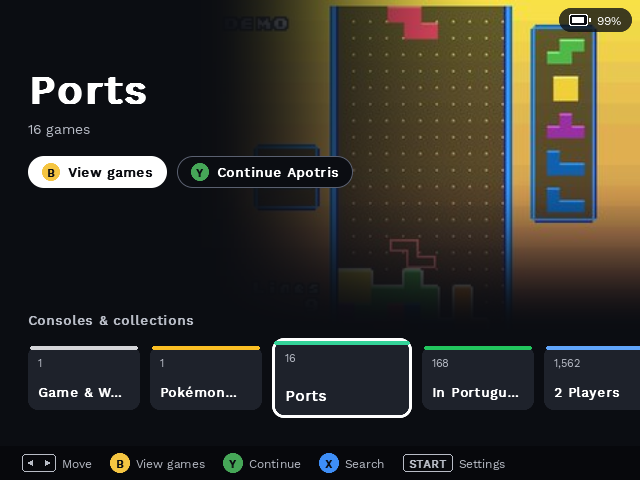 | 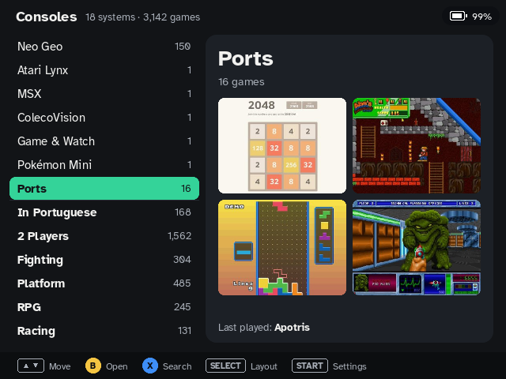 | 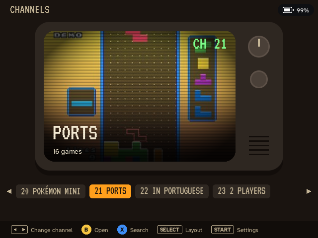 |
| 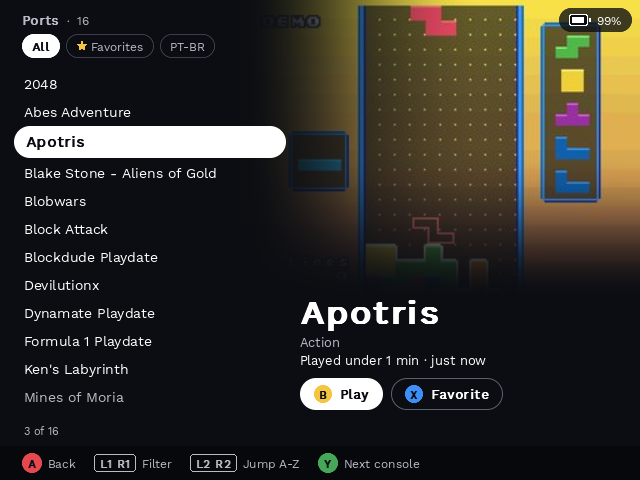 | 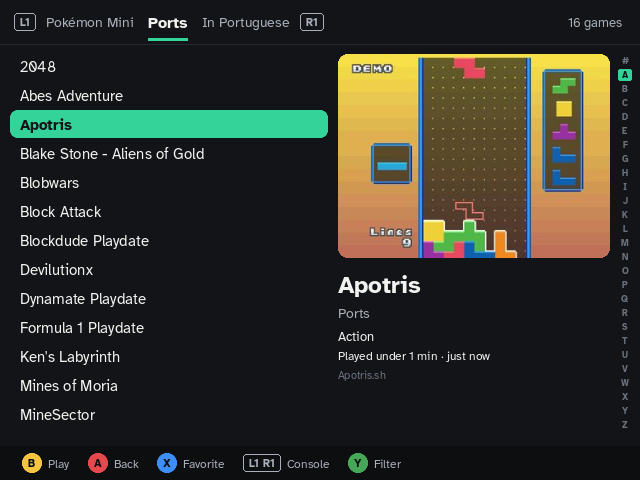 | 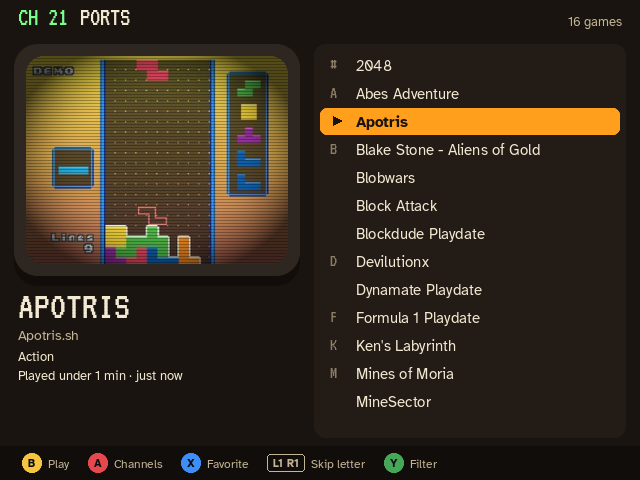 |

| Search | Cheats | Play time |
|---|---|---|
| 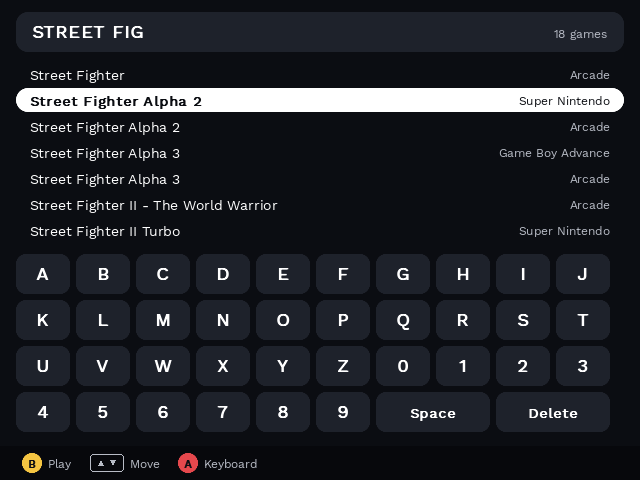 | 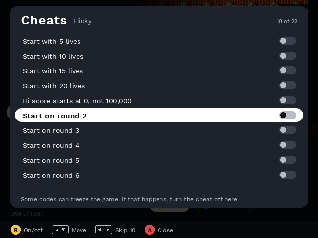 | 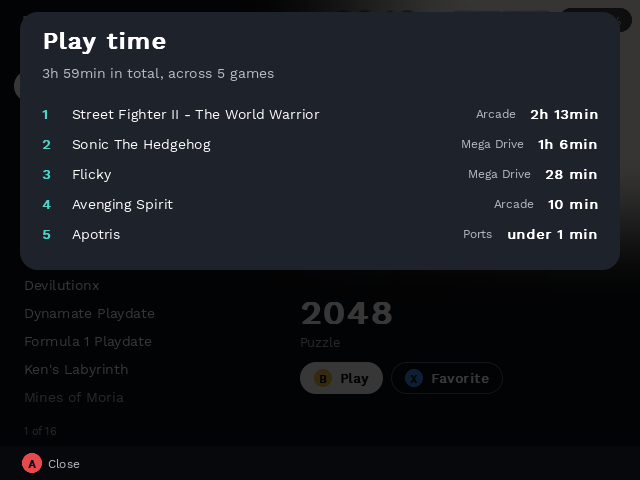 |

| Settings | In-game shortcuts |
|---|---|
| 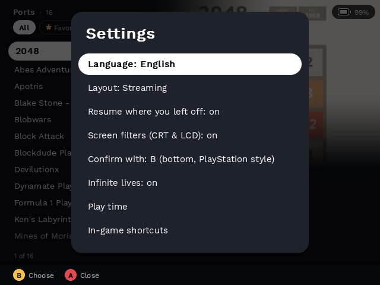 | 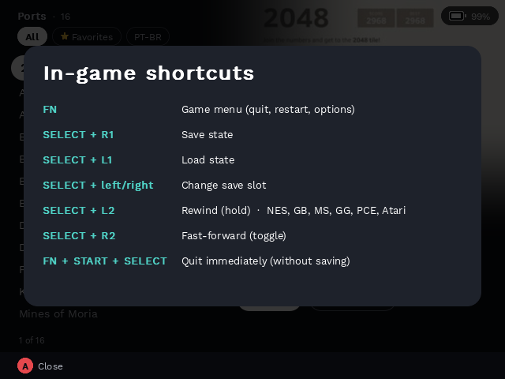 |

## Features

- **Three layouts**, switched with SELECT on the home screen: Streaming, Shelf and CRT TV.
- **Favorites, Recent and collections.** Automatic collections appear on the home screen only
  when they have games: Most played, In Portuguese (ROMs tagged `[PT-BR]`), 2 Players and genres
  (Fighting, Platform, RPG, Racing, Sports, Shooter) from the game info sheets, plus an optional
  curated Classics list. Inside a console, the list can be filtered to All, Favorites or PT-BR.
- **Search** by name with an on-screen keyboard, across every console, while you type.
- **Game info**: region and tags read from the file name, and year, genre, developer and number of
  players when a game info sheet exists.
- **Play time**: time played and last played per game, and a Play time screen in Settings.
- **Cheats panel**: when a cheat catalog exists for a game, SELECT in the list opens a panel to
  switch each cheat on or off. The chosen codes are written where RetroArch loads them before the
  game starts. A cheat file you made yourself in RetroArch is left alone.
- **Resume where you left off**: RetroArch's automatic save state on quit and load on start
  (on by default, can be turned off in Settings).
- **Save state shortcuts**: the opening screen and a reminder a few seconds into the game list the
  save, load, slot, rewind and fast-forward shortcuts (see [RetroArch](#retroarch) below).
- **Battery warning**: a strip on the home screen below 15% without the charger, with an estimate
  of the minutes left. During a RetroArch game below 4% without the charger, Vitrine asks RetroArch
  to save and quit so no progress is lost.
- **Bilingual UI**: English or Brazilian Portuguese, chosen in Settings. Until it is chosen, it
  follows RetroArch's `user_language`.
- Power off and Restart from Settings, through `/run/power-request` like Puppy's entries.

## Controls

By default **Confirm** is A (the right face button) and **Back** is B (the bottom face button),
as printed on the console. Settings > Confirm with switches Vitrine to PlayStation style (B
confirms). This only affects Vitrine's own screens. The hint bar at the bottom of each screen
always shows the current buttons.

| Screen | Buttons |
|---|---|
| Home | D-pad: choose a console or collection. Confirm: open it. Y: continue the last game played. X: search. SELECT: change layout. START: settings |
| Game list | Up/Down: move. Left/Right: skip 10. Confirm: play. Back: home. X: favorite. L2/R2: previous/next letter. SELECT: cheats (when available). START: settings |
| Game list, Streaming | L1/R1: filter. Y: next console |
| Game list, Shelf | L1/R1: previous/next console. Y: filter |
| Game list, CRT TV | L1/R1: previous/next letter. Y: filter |
| Search | D-pad: keyboard. Confirm: type. X: delete. Y: space. START: results. SELECT: close |

In a game, the goodluckOS shortcuts work as usual: FN opens the RetroArch menu (Quit comes back to
Vitrine) and FN+START+SELECT closes the game.

## Optional data files

Vitrine works with none of these. Without them every game from `apps.puppy` is still listed and
playable; the matching parts (pictures, game info, genre collections, cheats panel, Classics) just
do not show. Some folder names are in Portuguese: `capas` (covers), `fichas` (sheets), `trapacas`
(cheats), `classicos` (classics).

| Path | What it adds |
|---|---|
| `<roms folder>/icons/<rom name>.png` | The game picture, the same per-game icons Puppy uses (`ENTRY_ICONS_DIRECTORIES`, `.png`, `.jpg` or `.jpeg`) |
| `<roms folder>/capas/<rom name>.jpg` | Box art |
| `/home/player/vitrine/fichas/<roms folder name>.txt` | Game info sheet, one game per line, tab separated: ROM name without extension, year, genre, developer, number of players, and optionally the full title (useful for short arcade names) |
| `/home/player/vitrine/trapacas/<roms folder name>/<rom name>.txt` | Cheat catalog, one cheat per line: `kind<TAB>description<TAB>code\|code`, where kind is `L` (infinite lives), `C` (any other cheat) or `M` (master code, added when a Mega Drive Game Genie code is on) |
| `/home/player/vitrine/classicos.txt` | Classics collection, one ROM path per line, in display order |

Vitrine keeps its own state (favorites, recents, last position, settings, play time) as plain
text files in `/home/player/vitrine`.

## RetroArch

RetroArch saves its config when it closes, so before each game Vitrine sets these keys in
`/home/player/.config/retroarch/retroarch.cfg` to match its own settings:

- `apply_cheats_after_load`, `cheat_database_path` (cheats panel)
- `savestate_auto_save`, `savestate_auto_load` (Resume where you left off)
- `video_shader_enable` (Screen filters setting; it only has a visible effect with shader presets)
- `network_cmd_enable`, `network_cmd_port` (battery save and the shortcut reminder)
- `quick_menu_show_savestate_submenu`, `quick_menu_show_save_load_state`, `menu_savestate_resume`
- `user_language` (RetroArch menus in the same language as Vitrine)

The default goodluckOS `retroarch.cfg` does not bind the save state hotkeys that Vitrine's
reminders mention. To use them, bind them in RetroArch (Settings > Input > Hotkeys) or add these
lines to `retroarch.cfg` (SELECT is the hotkey enabler):

```
input_enable_hotkey_btn = "8"
input_save_state_btn = "5"
input_load_state_btn = "4"
input_state_slot_increase_btn = "16"
input_state_slot_decrease_btn = "15"
input_rewind_btn = "6"
input_toggle_fast_forward_btn = "7"
```

Rewind also needs `rewind_enable = "true"`, best set per core since it slows heavier cores down.

## Enabling it

**To try it**, open Puppy and start **Vitrine** from `Emulators/Frontends`. Settings > Back to
classic menu closes Vitrine and brings Puppy back, and so does Vitrine exiting for any reason.

**To start it at boot instead of Puppy**, highlight Vitrine in Puppy and press Y, Puppy's
autolaunch toggle (the tile gets an `autolaunch` badge). Puppy writes the entry to
`/home/player/autolaunch`, and at the next boot `/usr/local/bin/puppy-bootstrap.sh` runs that
command once before starting Puppy. Leaving Vitrine still opens Puppy. To go back, press Y on the
entry again, or delete the `autolaunch` file from the HOME partition.

The same can be done from a PC: create a file named `autolaunch` at the root of the HOME
partition containing the single line `vitrine`.

## Building

Vitrine is the `vitrine` package in `rootfs/package/vitrine` (enabled in `goodluck_defconfig`).
It is a single C++17 file built against SDL2, SDL2_image and SDL2_ttf, and installs:

- `/usr/bin/vitrine`
- `/usr/share/vitrine/fonts`: Atkinson Hyperlegible and VT323, both under the SIL Open Font
  License 1.1, with their license files. The base font is goodluckOS's Work Sans in
  `/usr/share/fonts`.

Fonts are looked up in `/usr/share/vitrine/fonts` first, then in `/home/player/vitrine/fontes`.
A missing font falls back to Work Sans.
